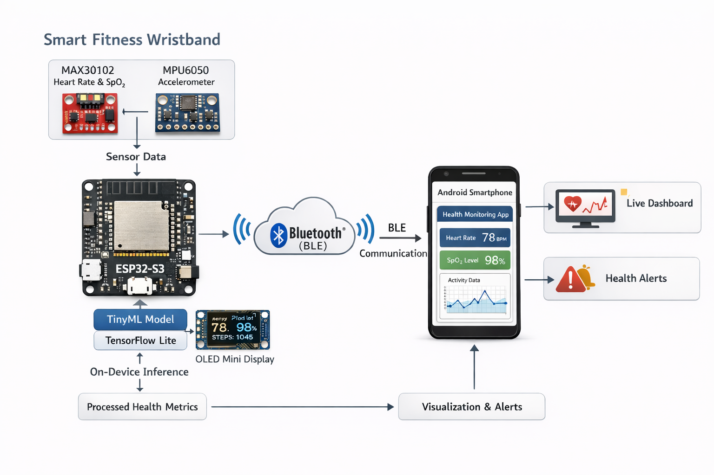
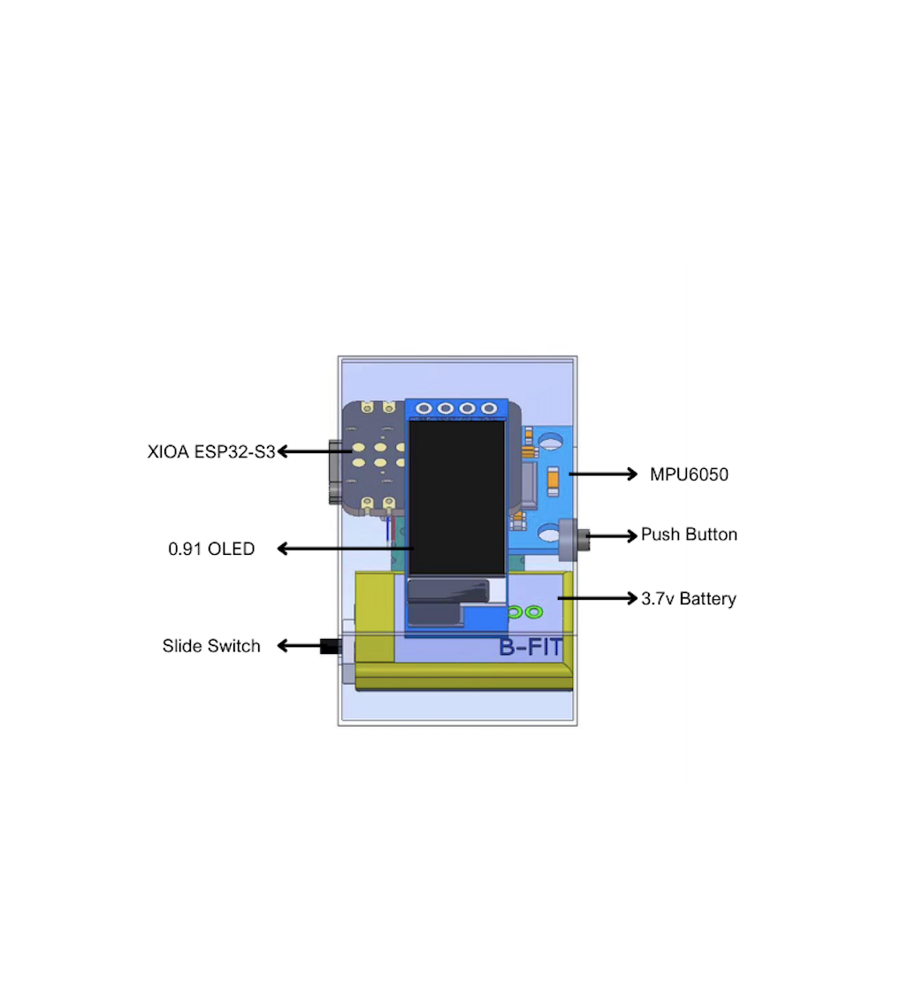
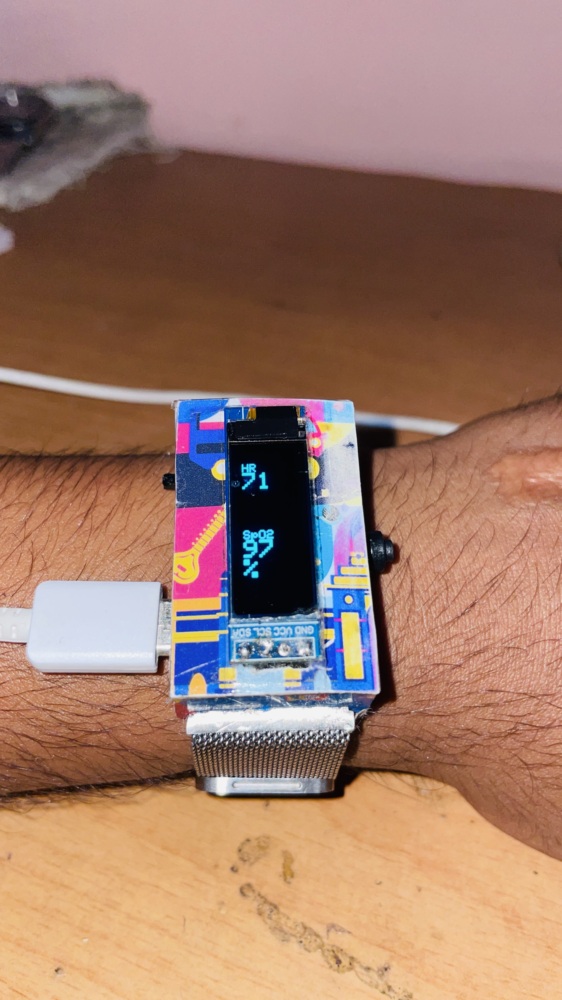
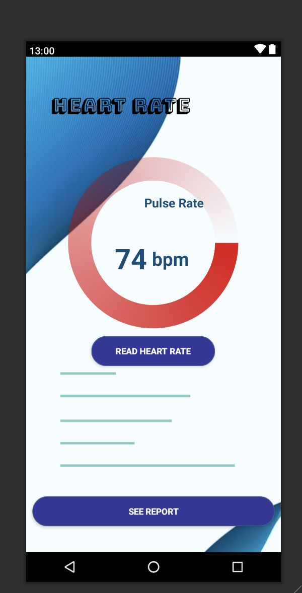

# 🏃 Smart Fitness Wristband – TinyML Health Monitoring System

An ESP32-S3 based Smart Fitness Wristband for real-time health monitoring using TinyML.  
The system tracks Heart Rate, SpO₂, and Motion Activity and streams data to an Android dashboard via BLE.

Patent Filed: Smart Fitness Wristband For Real-Time Health Monitoring (Patent No: 202511027460 A)

---

## 🚀 Features

- Real-time Heart Rate & SpO₂ monitoring (MAX30102)
- Motion tracking using MPU6050
- TinyML LSTM model for motion artifact reduction
- On-device inference using TensorFlow Lite Micro
- BLE communication to Android app
- Live visualization dashboard
- Early health alerts

---

## 🧠 Architecture

ESP32-S3 → Sensor Data → TinyML Model → BLE → Android App → Dashboard

  
  

  <em>System Architecture (Left) | Device CAD Design (Right)</em>

---

## 🛠 Tech Stack

**Embedded:** ESP32-S3, Arduino IDE  
**Machine Learning:** Python, TensorFlow, TensorFlow Lite Micro, LSTM  
**Mobile:** Android  
**Communication:** BLE  
**Data Processing:** Pandas, NumPy  

---

## 📁 Repository Structure

- esp32_firmware/ → ESP32 source code  
- tinyml_model/ → Training notebooks + .tflite model  
- android_app/ → Android dashboard  
- data/ → Sample PPG datasets  
- images/ → Device photos & diagrams  

---

## 📊 ML Pipeline

1. Collect PPG + accelerometer data  
2. Perform exploratory data analysis (EDA)  
3. Train LSTM model for noise removal  
4. Convert model to TensorFlow Lite  
5. Deploy on ESP32-S3  
6. Real-time inference + BLE streaming  

---

## 📈 Results

- Improved heart-rate accuracy by ~30%  
- Reduced motion artifacts significantly  
- Enabled real-time monitoring on low-power device  

---

## 📸 Demo

  
  

  <em>Real Fitness Band (Left) | Android App (Right)</em>

<video width="400" controls>
  <source src="images/Bfit_band.MOV.mp4" type="video/mp4">
  Your browser does not support the video tag.
</video>

---

## 👨‍💻 Author

Rohit Baghel  
Data Analyst / Embedded ML Developer  

LinkedIn: https://linkedin.com/in/rohit-baghel-a88073228  
GitHub: https://github.com/Rohittb04  

---

⭐ If you find this project useful, feel free to star the repo!
